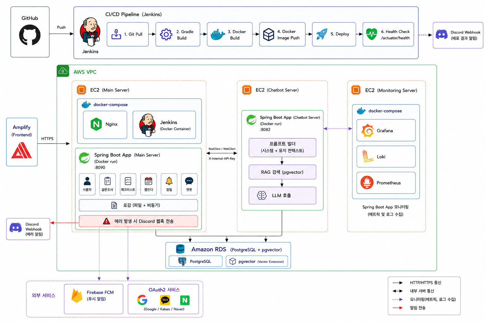
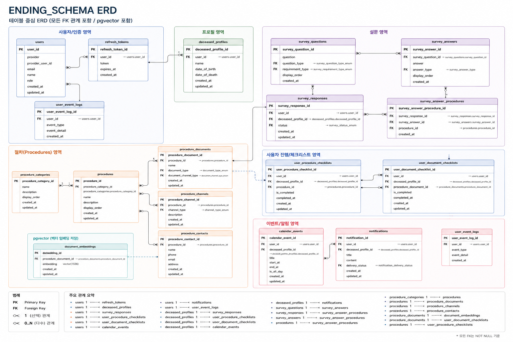

# 동행 Backend Server

- 사망 이후 절차 진행을 지원하는 동행 서비스의 메인 백엔드 서버

## 1. Project Overview

- 동행 Backend Server는 사망 이후 필요한 절차를 보다 쉽게 진행할 수 있도록 지원하는
동행 서비스의 메인 API 서버입니다.
   

- 사용자 인증, 설문조사, 체크리스트, 일정 및 알림 기능을 제공하며,
사용자 상황 기반 데이터를 관리합니다.
   

- 또한 AI 챗봇 서버와 연동하여
개인화된 절차 안내와 실시간 상담 기능을 제공합니다.

## 2. 주요 기능

| 기능 | 설명 |
| --- | --- |
| 사용자 | OAuth2 기반 소셜 로그인 및 JWT 인증을 지원하며, 사용자 및 고인 정보를 관리 |
| 설문조사 | 사용자 상황 기반 설문조사를 통해 필요한 절차를 체크리스트로 생성 |
| 체크리스트 | 사망 이후 필요한 행정·금융·상속 절차를 체크리스트 형태로 제공 |
| 알림 | 체크리스트 기한 기반 FCM 푸시 알림 제공 |
| 일정 | 체크리스트 기반 일정 등록 및 관리 |
| 채팅 | AI 챗봇 서버와 연동하여 개인화된 절차 안내 및 SSE 기반 실시간 스트리밍 응답 제공 |

## 3. 기술 스택
### Backend


### Database


### Infrastructure


### Monitoring & Logging


### External Service


## 4. 시스템 아키텍처


## 5. 주요 구현 내용

### OAuth2 + JWT 기반 인증

- Google / Kakao / Naver OAuth2 로그인 지원
- JWT 기반 Stateless 인증 구조 적용
- AccessToken + HttpOnly RefreshToken 방식 적용

### 설문 기반 체크리스트 생성

- 사용자 설문 응답 기반 절차 추천
- 절차 우선순위 및 기한 기반 체크리스트 생성

### 체크리스트 기반 일정 생성

- 체크리스트 완료 시 캘린더 일정 자동 생성
- uniqueKey 기반 일정 중복 생성 방지

### Batch Insert 기반 대량 데이터 처리 최적화
- 설문 제출 및 알림 생성 과정에서 다수의 Insert 쿼리 발생
- DB I/O 감소를 위해 JdbcTemplate `batchUpdate` 기반 Batch Insert 적용
- k6 기반 성능 측정 진행
- 1000건 요청 기준 처리 시간 14,385ms → 108ms 단축

### FCM 푸시 알림

#### 구현 내용

- Firebase Admin SDK 기반 푸시 알림 발송 환경 구축
- 프론트엔드에서 발급한 FCM 토큰을 백엔드 API로 등록 및 암호화 저장
- FirebaseApp, FirebaseMessaging Bean 등록을 통해 발송 모듈 구성

#### 발송 시나리오

- 매일 오전 9시 스케줄러 기반 D-Day 알림 발송
- 체크리스트 카테고리 완료 시 비동기 이벤트 기반 알림 발송

#### 안정성 처리

- Insert / FCM 발송 / Status Update 단계로 트랜잭션 분리
- 멱등성 키 기반 중복 발송 방지
- 실패 유형별 최대 3회 재시도 처리 (500ms Backoff)

### AI 챗봇 연동

- AI 요청 증가 시 메인 서버 자원 점유 증가 -> AI 챗봇 서버를 별도 EC2로 분리하여 운영
- SSE 기반 실시간 스트리밍 적용
- Java 21 Virtual Thread 기반 스트리밍 처리


## 6. 서버 배포

- Jenkins Pipeline 기반 자동 배포 구성
- GitHub Push 이후 빌드, Docker 이미지 생성, 컨테이너 재실행 자동화
- Spring Boot App은 `docker run` 방식으로 배포
- Jenkins / Nginx는 Docker Compose 기반으로 운영
- 배포 안정성을 위해 Health Check 적용
- Discord Webhook 기반 배포 결과 및 에러 알림 적용

## 7. 모니터링

- 별도 Monitoring EC2에 Grafana / Prometheus / Loki 구성
- Prometheus 기반 Spring Boot App 메트릭 수집
- Loki 기반 애플리케이션 로그 수집
- `traceId`, `userId` 기반 요청 로그 추적
- Grafana 대시보드를 통한 메트릭 및 로그 통합 관리

## 8. ERD



## 9. 실행 방법

### Prerequisites

- Java 21
- PostgreSQL
- Firebase 서비스 계정 키(JSON)
- OAuth2 Client 정보
- 실행 중인 Chatbot Server

### Configuration

- `application-example.yml`을 참고하여 `src/main/resources/application.yml` 파일을 생성합니다.   
     

- DB 생성 SQL은 아래 경로에 있습니다.   
   `docs/db/schema.sql`
   

- Firebase 서비스 계정 키는 아래 경로에 저장합니다.   
  `secrets/firebase-service-account.json`

### Local Run
```
./gradlew bootRun
```

### Build
```
./gradlew build
```
### Docker Run
```
docker build -t accompany-backend .

docker run -d \
--name accompany-backend \
-p 8080:8080 \
accompany-backend
```

## 10. 프로젝트 구조
```text
src/main/java/org/accompany/backend
├── global
│   ├── code
│   │   ├── ErrorCode.java
│   │   └── SuccessCode.java
│   ├── config
│   │   ├── SecurityConfig.java
│   │   ├── OAuth2Config.java
│   │   └── OpenApiConfig.java
│   ├── exception
│   ├── interceptor
│   ├── response
│   └── security
│       ├── jwt
│       └── oauth
└── domain
    ├── user
    ├── deceasedProfile
    ├── survey
    ├── checklist
    │   ├── controller
    │   ├── dto
    │   │   ├── request
    │   │   └── response
    │   ├── entity
    │   ├── repository
    │   └── service
    ├── procedure
    ├── notification
    ├── calendar
    └── chat
```

## 11. 팀원 및 역할

| 팀원 | 담당 도메인 | 주요 구현 내용                                                                                                                   | 서버 구축 |
| --- | --- |----------------------------------------------------------------------------------------------------------------------------| --- |
| 남수진 | 사용자 / 고인 / 챗봇 | OAuth2 기반 소셜 로그인 및 JWT 인증 구현<br>사용자 및 고인 정보 관리<br>사용자 이벤트 로그 수집 및 추적<br>SSE 기반 실시간 스트리밍 응답 처리<br>AI 챗봇 서버 연동 및 내부 API 통신 구성 | Nginx Reverse Proxy<br>HTTPS 인증서 적용<br>pgvector 기반 벡터 DB 구성 |
| 이은성 | 절차 / 체크리스트 / 캘린더 | 체크리스트 및 제출 서류 정보 관리<br>체크리스트 기반 일정 자동 생성 및 중복 방지<br>Grafana / Prometheus / Loki 기반 모니터링 환경 구축 | Docker 기반 서버 운영<br>Jenkins 기반 CI/CD 구축<br>PostgreSQL 및 모니터링 서버 구축 |
| 김준형 | 설문조사 / 알림 | 설문 문항 및 응답 관리<br>설문 기반 절차 추천 기능 구현<br>Batch Insert 기반 대량 데이터 처리 최적화<br>FCM 기반 푸시 알림 발송 환경 구축<br>스케줄러 및 이벤트 기반 알림 처리        | Docker 기반 서버 운영<br>Jenkins 기반 CI/CD 구축<br>PostgreSQL 서버 구축 |